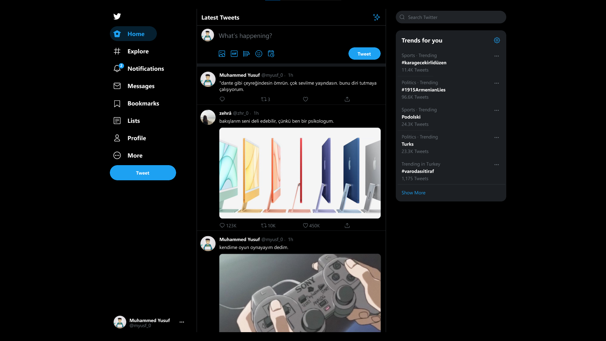

# WTMB Homeworks

Hello, I'm Muhammed Yusuf and I'm following up [Armagan Amcalar's](https://github.com/dashersw) WTMB Javascript Crash Courses. And these are my projects based on homeworks.

## Page Design

Page has been designed in Figma by followin up [Adem İlter's](https://github.com/ademilter) Figma tutorial.

